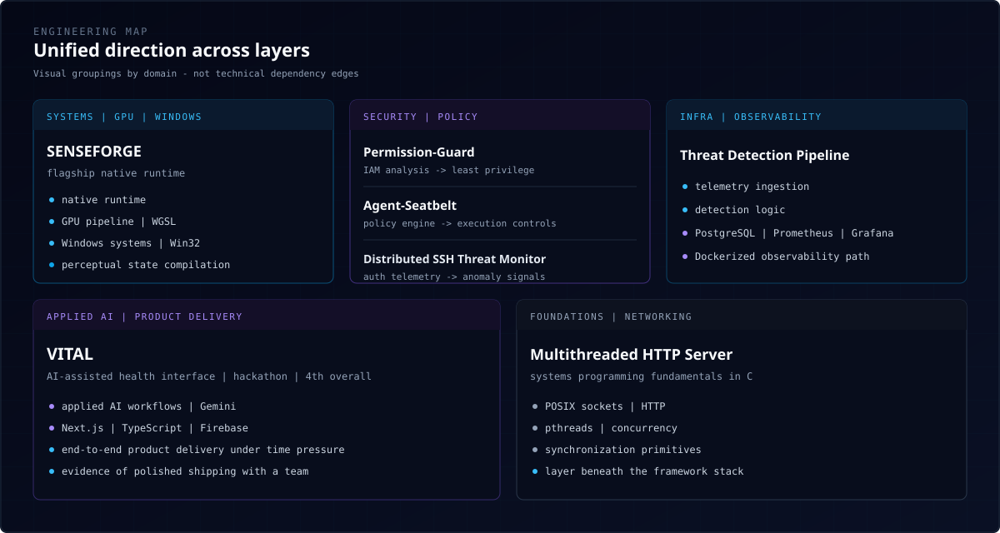
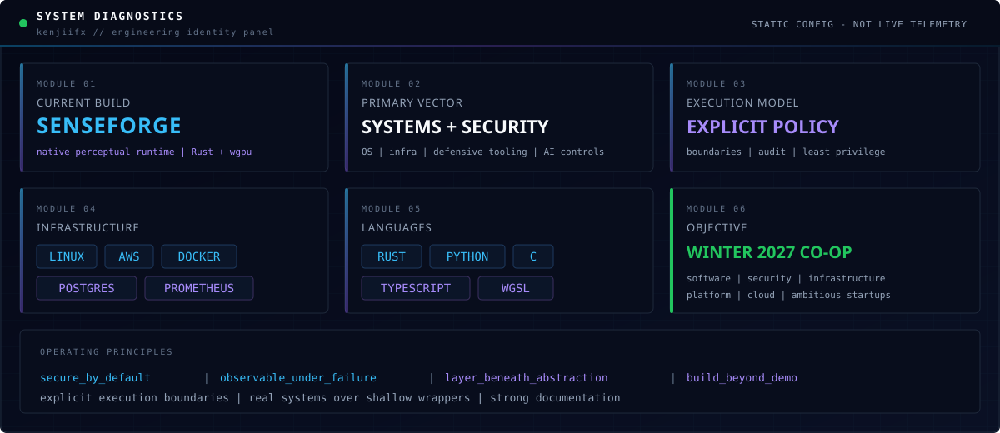

<a id="readme-top"></a>

<!--
  MOOSA ALAM — GITHUB PROFILE
  kenjiifx/kenjiifx
  Systems · Security · AI Infrastructure
-->

<p align="center">
  
</p>

<p align="center">
  <em>I build software where security, infrastructure, operating systems, graphics, and applied AI meet real constraints.</em>
</p>

<p align="center">
  <a href="https://moosaalam.vercel.app"></a>
  <a href="https://linkedin.com/in/moosa-alam"></a>
  <a href="mailto:alammoosa07@gmail.com"></a>
  <a href="https://github.com/kenjiifx?tab=repositories"></a>
</p>

<br />

## `01 // SYSTEM.IDENTITY`

<table>
<tr>
<td width="48%" valign="top">

```yaml
name: Moosa Alam
handle: kenjiifx
location: Ontario, Canada
education: CS Co-op · University of Guelph
contact: alammoosa07@gmail.com

vector:
  - systems programming
  - security engineering
  - infrastructure / platform
  - applied AI systems

principles:
  - secure by default
  - observable under failure
  - understand the layer beneath
  - build beyond the demo
  - explicit execution boundaries

target: Winter 2027 co-op
```

</td>
<td width="52%" valign="top">

**Systems-focused builder across the stack.**

I work where software meets hard constraints: OS behaviour, native Windows tooling, GPU pipelines, cloud infrastructure, defensive security, and AI systems with explicit execution controls.

Not only a cybersecurity student. I build across operating-system behaviour, backend systems, security tools, infrastructure, and full-stack product experiences — with a bias toward real systems over shallow wrappers.

</td>
</tr>
</table>

<br />

## `02 // FLAGSHIP.SYSTEM`

<table>
<tr>
<td valign="top">

### [SENSEFORGE](https://github.com/kenjiifx/SENSEFORGE) — Native Perceptual Runtime

A **native Windows perceptual-computing runtime** built with Rust, wgpu, WGSL, and Win32. Abstract sensory state is compiled into real-time visual output through a click-through transparent overlay.

| Layer | Focus |
|:------|:------|
| **Runtime** | SenseGenome · PerceptualCompiler · PerceptualRuntime |
| **Graphics** | wgpu · WGSL · uniform alignment · real-time output |
| **Platform** | Win32 · click-through transparent overlays |
| **Challenge** | shader/uniform debugging · low-level window behaviour · latent sensory state |

`Rust` `wgpu` `WGSL` `Win32` `real-time rendering`

**Why it is distinct:** original systems abstraction spanning GPU pipelines and OS-level window behaviour — not a demo wrapper around an API.

→ **[Open repository](https://github.com/kenjiifx/SENSEFORGE)**

</td>
</tr>
</table>

<br />

## `03 // SELECTED.SYSTEMS`

<table>
<tr>
<td width="50%" valign="top">

### [VITAL](https://github.com/kenjiifx/VITAL)
`product · applied AI`

AI-assisted health interface built in a hackathon. Placed **4th overall**.

`Next.js` `TypeScript` `Firebase` `Gemini`

**Why it matters:** polished end-to-end product delivery under time pressure with a team.

</td>
<td width="50%" valign="top">

### [Permission-Guard](https://github.com/kenjiifx/Permission-Guard)
`security · IAM`

Defensive IAM analysis CLI that surfaces excessive privileges and improves least-privilege visibility.

`Python` `AWS IAM` `CLI` `static analysis`

**Why it matters:** turns dense authorization policy into actionable security signal.

</td>
</tr>
<tr>
<td width="50%" valign="top">

### [Agent-Seatbelt](https://github.com/kenjiifx/Agent-Seatbelt)
`AI safety · policy`

Runtime safety and policy layer for AI-agent actions — dangerous command detection, host protection, auditable decisions.

`Python` `policy enforcement` `execution control`

**Why it matters:** treats agent safety as systems and policy enforcement, not prompt engineering.

</td>
<td width="50%" valign="top">

### [Threat Detection Pipeline](https://github.com/kenjiifx/Threat-Detection-Pipeline)
`security · observability`

Security event pipeline with detection logic, storage, and operational metrics.

`Python` `PostgreSQL` `Prometheus` `Grafana` `Docker`

**Why it matters:** joins detection with the telemetry required to operate it.

</td>
</tr>
<tr>
<td width="50%" valign="top">

### [Distributed SSH Threat Monitor](https://github.com/kenjiifx/Distributed-SSH-Threat-Monitor)
`security · networking`

Distributed monitoring for suspicious SSH access behaviour and anomaly signals.

`Python` `SSH` `auth telemetry` `anomaly detection`

**Why it matters:** defensive visibility into authentication patterns across hosts.

</td>
<td width="50%" valign="top">

### [Multithreaded HTTP Server](https://github.com/kenjiifx/Multithreaded-HTTP-Server)
`systems · networking`

Concurrent HTTP server in C using sockets and pthreads.

`C` `POSIX sockets` `pthreads` `concurrency`

**Why it matters:** direct contact with networking, synchronization, and the primitives beneath frameworks.

</td>
</tr>
</table>

<p align="center">
  <a href="https://github.com/kenjiifx?tab=repositories"></a>
</p>

<br />

## `04 // ENGINEERING.MAP`

Projects span systems, security, infrastructure, and applied AI — grouped by direction, not by false dependency edges.

<p align="center">
  
</p>

<br />

## `05 // CAPABILITY.MATRIX`

<p align="center">
  
</p>

<table>
<tr>
<td width="50%" valign="top">

### Systems
Rust · C · Win32 · wgpu / WGSL · concurrency · sockets · Linux

</td>
<td width="50%" valign="top">

### Security
IAM / least privilege · policy enforcement · defensive tooling · security telemetry · anomaly detection · runtime guardrails

</td>
</tr>
<tr>
<td width="50%" valign="top">

### Infrastructure
AWS · Docker · PostgreSQL · Prometheus / Grafana · GitHub Actions · logging & monitoring

</td>
<td width="50%" valign="top">

### Product
TypeScript · Next.js / React · Node.js · FastAPI · Firebase · API design · full-stack delivery

</td>
</tr>
</table>

<br />

## `06 // SYSTEM.DASHBOARD`

Custom engineering identity panel — replaces fragile third-party stats widgets.

<p align="center">
  
</p>

<br />

## `07 // BUILD.LOG`

```text
2026
├── SENSEFORGE ......................... native perceptual runtime (Rust · wgpu · Win32)
├── VITAL .............................. AI health interface · 4th overall (hackathon)
├── Permission-Guard ................... IAM analysis · least-privilege CLI
├── Agent-Seatbelt ..................... AI-agent runtime policy & execution controls
├── Threat Detection Pipeline .......... detection · storage · observability
├── Distributed SSH Threat Monitor ..... auth telemetry · anomaly signals
└── Multithreaded HTTP Server .......... concurrent networking in C
```

<br />

## `08 // CURRENT.OBJECTIVES`

<table>
<tr>
<td width="50%" valign="top">

### Now
- Advance **SENSEFORGE** beyond prototype stage
- Deepen Linux, networking, cloud, and infrastructure fundamentals
- Build secure AI systems with explicit execution controls
- Improve project documentation and public demos

</td>
<td width="50%" valign="top">

### Next
- Earn a **Winter 2027** software / security / infrastructure co-op
- Contribute meaningful defensive open-source work
- Build a telemetry-driven homelab
- Ship a project with real external usage

</td>
</tr>
</table>

<br />

## `09 // ESTABLISH.CONNECTION`

**I am looking for teams building serious software around systems, infrastructure, security, developer platforms, applied AI, or technically ambitious products.**

If you are hiring for Winter 2027 co-op — or collaborating on deep-tech systems work — reach out.

<p align="center">
  <a href="mailto:alammoosa07@gmail.com"></a>
  <a href="https://linkedin.com/in/moosa-alam"></a>
  <a href="https://moosaalam.vercel.app"></a>
</p>

<br />

<p align="center">
  
</p>

<p align="center">
  <code>Build beyond the interface. Understand the system beneath it.</code>
</p>

<p align="center">
  <a href="#readme-top">↑ return to top</a>
</p>
