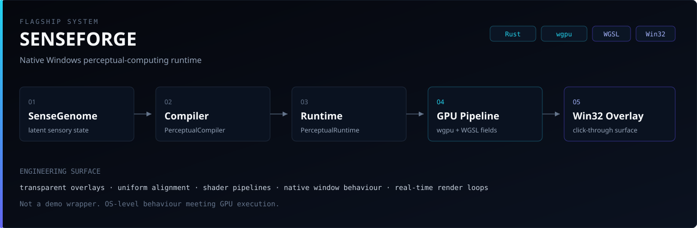
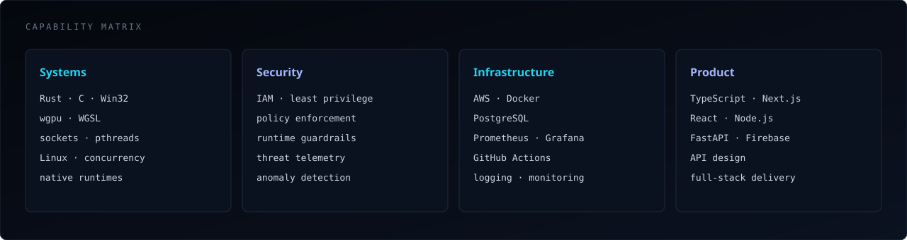

<p align="center">
  
</p>

<p align="center">
  <a href="https://moosaalam.vercel.app"></a>
  <a href="https://linkedin.com/in/moosa-alam"></a>
  <a href="mailto:alammoosa07@gmail.com"></a>
  <a href="https://github.com/kenjiifx?tab=repositories"></a>
</p>

<table>
<tr>
<td width="55%" valign="top">

I design and ship software across **systems boundaries** — native runtimes, defensive security tooling, cloud infrastructure, and applied AI with explicit execution controls.

CS Co-op @ **University of Guelph**. Targeting **Winter 2027** roles in software, security, infrastructure, systems, cloud, or platform engineering.

</td>
<td width="45%" valign="top">

```text
focus     systems + security + infra
runtime   Rust / C / Python / TS
surface   Win32 · Linux · AWS · GPU
hiring    Winter 2027 co-op
```

</td>
</tr>
</table>

<br />

## Flagship — [SENSEFORGE](https://github.com/kenjiifx/SENSEFORGE)

<p align="center">
  
</p>

A **native Windows perceptual-computing runtime**: SenseGenome state compiled through a custom perceptual stack into real-time GPU output on a click-through Win32 overlay.

Hard problems touched: shader/uniform alignment, transparent window behaviour, real-time render loops, and an original runtime architecture — not a thin API wrapper.

→ [github.com/kenjiifx/SENSEFORGE](https://github.com/kenjiifx/SENSEFORGE)

<br />

## Selected Systems

<table>
<tr>
<td width="50%" valign="top">

### [VITAL](https://github.com/kenjiifx/VITAL)
`product` `applied AI`

AI-assisted health interface. Shipped under hackathon constraints. **4th overall.**

`Next.js` `TypeScript` `Firebase` `Gemini`

</td>
<td width="50%" valign="top">

### [Permission-Guard](https://github.com/kenjiifx/Permission-Guard)
`security` `IAM`

Defensive CLI for AWS IAM policy analysis and over-privilege detection.

`Python` `AWS IAM` `static analysis`

</td>
</tr>
<tr>
<td width="50%" valign="top">

### [Agent-Seatbelt](https://github.com/kenjiifx/Agent-Seatbelt)
`AI safety` `policy`

Runtime execution-control layer for AI-agent actions. Policy before process.

`Python` `guardrails` `host protection`

</td>
<td width="50%" valign="top">

### [Threat Detection Pipeline](https://github.com/kenjiifx/Threat-Detection-Pipeline)
`detection` `observability`

Ingest → detect → store → expose metrics. Built to be operated, not just demoed.

`Python` `PostgreSQL` `Prometheus` `Grafana` `Docker`

</td>
</tr>
<tr>
<td width="50%" valign="top">

### [Distributed SSH Threat Monitor](https://github.com/kenjiifx/Distributed-SSH-Threat-Monitor)
`networking` `telemetry`

Distributed monitoring for suspicious SSH behaviour and anomaly signals.

`Python` `SSH` `auth telemetry`

</td>
<td width="50%" valign="top">

### [Multithreaded HTTP Server](https://github.com/kenjiifx/Multithreaded-HTTP-Server)
`systems` `networking`

Concurrent HTTP server from sockets and pthreads up.

`C` `POSIX` `concurrency`

</td>
</tr>
</table>

<br />

## Capability Surface

<p align="center">
  
</p>

<br />

## Current Vector

| Now | Next |
|:----|:-----|
| Advance SENSEFORGE past prototype | Land a Winter 2027 co-op |
| Linux, networking, cloud depth | Defensive open-source contributions |
| Secure AI with hard execution boundaries | Telemetry-driven homelab |
| Stronger docs + public demos | Ship something with real external users |

<br />

<p align="center">
  <strong>Building serious systems software.</strong> If that is what your team ships — talk to me.
</p>

<p align="center">
  <a href="mailto:alammoosa07@gmail.com">alammoosa07@gmail.com</a>
  &nbsp;·&nbsp;
  <a href="https://linkedin.com/in/moosa-alam">LinkedIn</a>
  &nbsp;·&nbsp;
  <a href="https://moosaalam.vercel.app">Portfolio</a>
</p>
